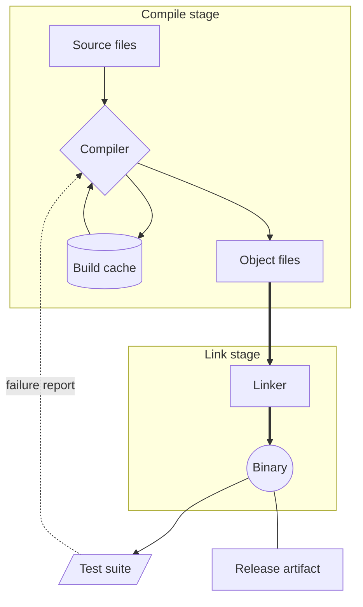

# A build pipeline, and which stage depends on which

This one is here because it uses subgraphs, several link styles, and a couple of relations that
run in the direction people do not expect.

Source files are compiled into object files. Object files are linked into a binary. That much
is obvious. The two that catch people out are the cache and the test suite. The compiler reads
the cache and also writes to it, so there are two links between them and they point opposite
ways. And the test suite depends on the binary, not the other way round, even though a failing
test is usually described as blocking the build.

The dotted link is a report rather than a build dependency, and the plain undirected line
between the binary and the release artifact says the two are the same bytes under different
names, with no direction to the relationship at all.
