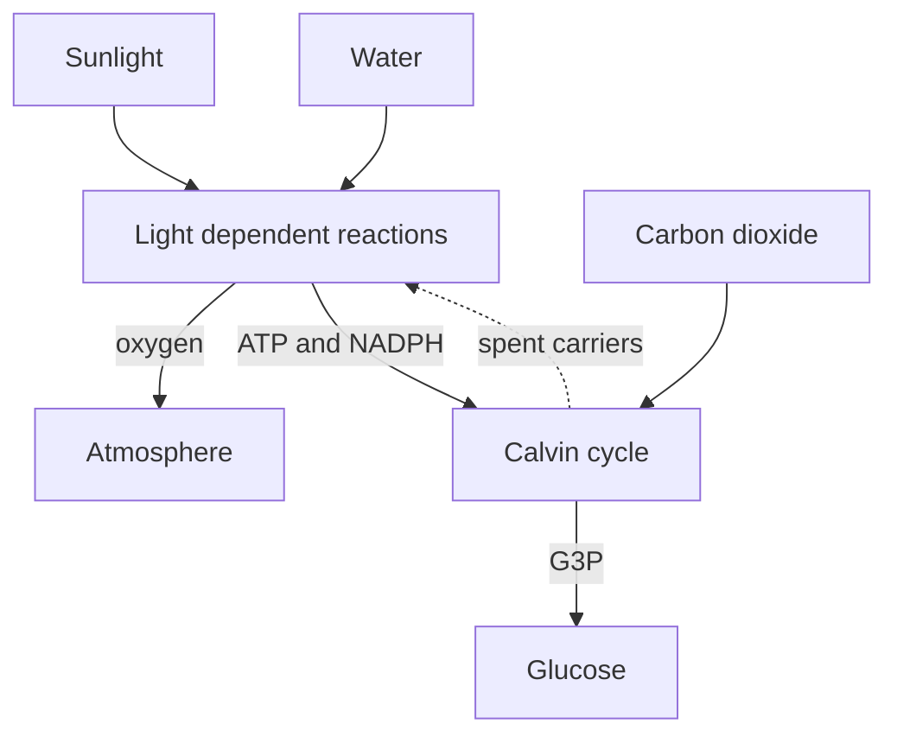

# How a leaf turns light into sugar

Photosynthesis is two linked stages, and the thing worth remembering is which way each
dependency runs. The light dependent reactions happen in the thylakoid membrane. They take in
light and water, and they produce three things: oxygen, which leaves the plant, and two
energy carriers called ATP and NADPH, which do not.

The Calvin cycle happens in the stroma, outside the thylakoid. It consumes carbon dioxide, and
it consumes the ATP and NADPH the first stage made. It produces the sugar G3P, from which the
plant builds glucose.

The direction that people most often get backwards is between the two stages. The light
reactions feed the Calvin cycle, and not the other way round. The Calvin cycle sends the spent
carriers back, which is a real dependency but a different one, and it runs from the cycle to
the light reactions rather than from them to it.

Three details in that diagram are worth checking yourself on. Water enters the light reactions
and not the Calvin cycle. Carbon dioxide enters the Calvin cycle and not the light reactions.
And the return path for the spent carriers is drawn dotted, because it is a recycling loop
rather than a forward step in the pathway.
