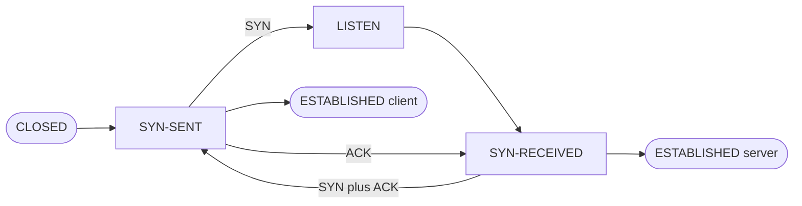

# What happens before a TCP connection carries any data

A TCP connection does not start with data. It starts with three messages whose only job is to
agree that both ends can hear each other, and to agree on the sequence numbers each side will
count from.

The client moves first. It sends a segment with the SYN flag set, carrying its own initial
sequence number, and then sits in SYN-SENT. The server, which has been sitting in LISTEN,
answers with a single segment that has both SYN and ACK set: the ACK confirms the client's
sequence number and the SYN carries the server's own. The server then sits in SYN-RECEIVED.
The client answers that with a plain ACK, and at that point the client considers the
connection established. The server considers it established when that third message arrives.

The asymmetry is the part people get backwards. The middle message goes from server to client,
not client to server, and the third goes from client to server again.

Note that the two ESTABLISHED states are drawn separately. They are reached at different
moments, and treating them as one node hides the window in which the client is sending and the
server has not yet finished opening.
